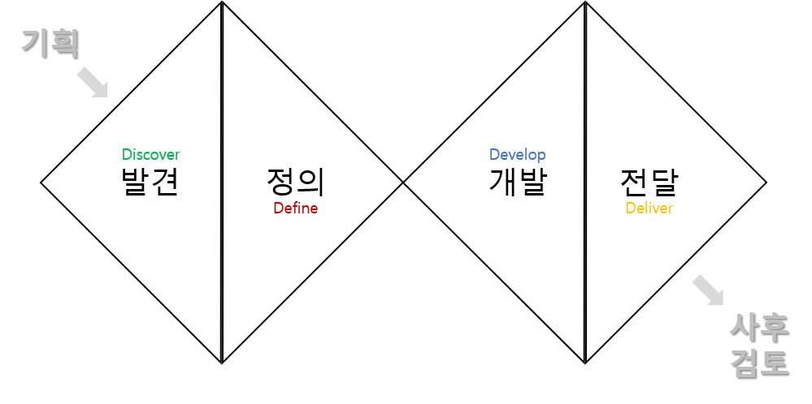

# 1. 서비스·경험디자인 기획설계
## 　4) 서비스·경험디자인 수행계획 수립
### 　　1} 수행계획 수립
#### 　　　1] 프로젝트 목표 파악

본 항목은, 더블 다이아몬드 프로세스 중 **기획** 단계를 설명하는 곳입니다.

##### 프로젝트의 목표란?
프로젝트의 목표는 <u>①이해가 용이하고, ②명확하고, ③측정 가능하게. </u> 이루어져야 합니다. (ex. 사용자에게 재미와 즐거움을 주는 것/웹 사이트 트래픽 증가시키기/매출 20% 올리기)

##### 프로젝트의 목표를 잘 정하기 위한 수단
프로젝트의 목표를 잘 정하기 위해서는, 제품 수명 주기, SWOT 분석, 경쟁사 분석 등을 통해 프로젝트에 영향을 주는 팀의 내/외부 요소를 파악하여야 합니다. 

##### 프로젝트의 목표를 정했다면?
프로젝트의 목표를 정했다면, 제안서를 작성하게 됩니다.